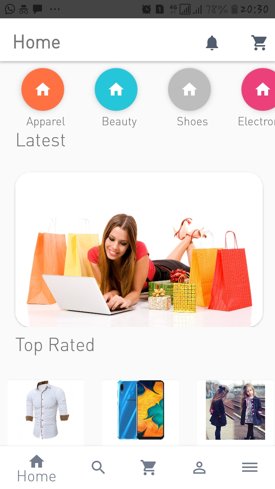
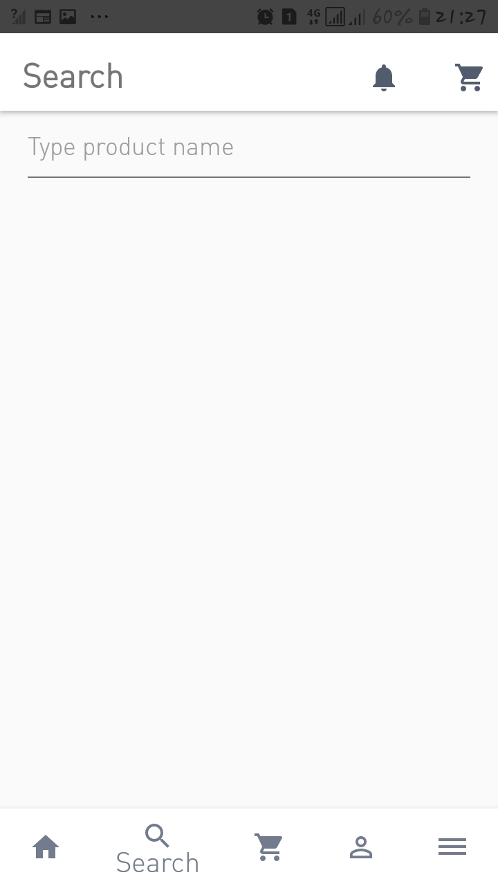

# Shoppy
Do shopping at your couch 
State of the art app demonstrating a normal shopping application flow:
User Stories
1. Login and SignUp
2. View Products
3. Add Products to cart
4. View Cart
5. Remove Products from cart
6. Checkout using preffered method of payment
7. Track item ordered
8. Live chat for user support
9. User feedback on app performance
10. Change user information eg Username or Password
11. Receive time to time marketing emails and messages
...

<h2>Screens</h2>
<h5>1. Home</h5>
 

<h5>2. Search</h5>
 
